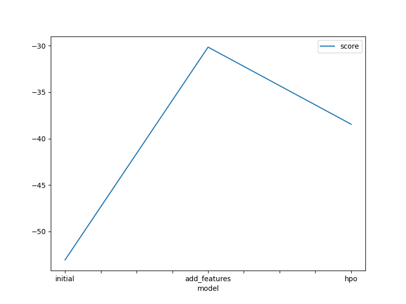
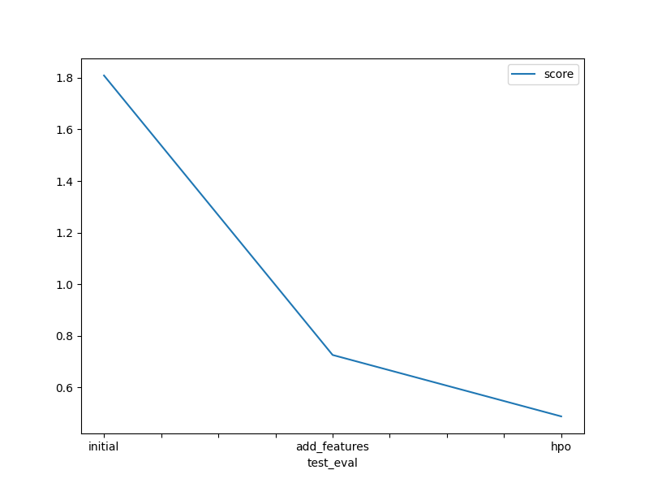

# Report: Predict Bike Sharing Demand with AutoGluon Solution
#### Sirish Silpakar

## Initial Training
### What did you realize when you tried to submit your predictions? What changes were needed to the output of the predictor to submit your results?
The predictions could not be submitted in case of values less than 0. Initially, no such values were generated, however to be on the safe side, any possible values < 0 was updated to 0.
After this change, the predictor output was submitted successfully.

### What was the top ranked model that performed?
The top ranked model during the initial run was the 'WeightedEnsemble_L3' model which resulted in a score of -53.062678 RMSE. 

## Exploratory data analysis and feature creation
### What did the exploratory analysis find and how did you add additional features?
The EDA was performed by inspecting the data for the different features in multiple graphs. The time series graph clearly showed a trend in the hourly, daily, and monthly timeframes. The datetime feature was separated into hour, day, and month timeframe with each being a different feature.
Additionally, The histogram for each feature displayed normal distribution for humidity and atemp, and windspeed features. So, these features were separated into categories and one hot encoded to derive the new features.

### How much better did your model preform after adding additional features and why do you think that is?
The model score improved drastically on adding these features, while the same was true for the Kaggle score as well.
Seggregation of these features allowed the data to be used more effectively. Essentially, the use of these new features must have made some mathematical sense / connection, so when the regression was performed it produced more accurate results as shown from the improved score.

## Hyper parameter tuning
### How much better did your model perform after trying different hyper parameters?
The model performed slightly worse based on the model evaluation score. However, the Kaggle score was better than when using the new features.
This points to the fact that the model did not perform quite as good with the test data than it did with some validation data.
Overall, the different hyperparameter tuning produced a significant increase in the overall performance of the model.

### If you were given more time with this dataset, where do you think you would spend more time?
I would spend more time in testing the hyperparameters for the individual algorithm / models.
This seems to have made a difference in the overall model performance so further fine tuning should serve to increase the performance.

### Create a table with the models you ran, the hyperparameters modified, and the kaggle score.
|model|hpo1|hpo2|hpo3|score|
|--|--|--|--|--|
|initial|{}|{}|{}|1.80891|
|add_features|{}|{}|{}|0.72621|
|hpo|NN_TORCH|GBM|XGB|0.48829|

### Create a line plot showing the top model score for the three (or more) training runs during the project.

### Create a line plot showing the top kaggle score for the three (or more) prediction submissions during the project.

## Summary
A model for the Bike Sharing Demand was created successfully using AutoGluon.
The model was iteratively improved through analysis of the provided data, and tuning of the hyperparameters in the model.
The EDA allowed to fill in gaps with the introduction of new feature / data columns and the tuning of the hyperparameters in the model added onto it.
Overall, the prediction for the bike sharing demand was implemented and improved through the use of proper ML processes.
